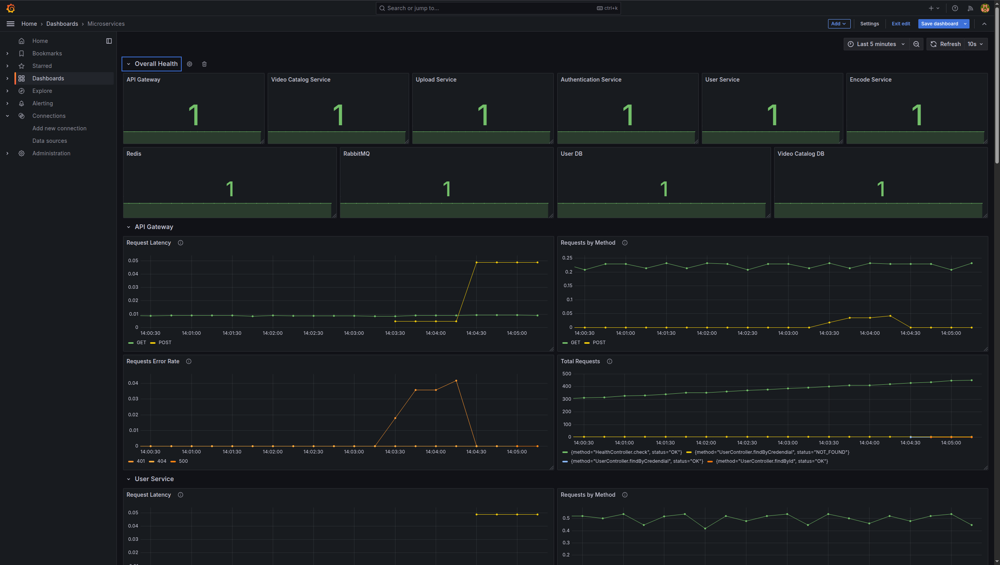

# STREAMING PLATFORM - MICROSERVICES

A Streaming platform based on Microservices architecture.


### Table of Contents

- [Technologies](#technologies)
- [Microservices Overview](#microservices-overview)
- [Storage and Streaming](#storage-and-streaming)
- [Monitoring and Logging](#monitoring-and-logging)
- [Setup - Docker Compose](#setup---docker-compose)
- [Grafana Dashboards](#grafana-dashboards)
- [Setup - Kubernetes](#setup---kubernetes)
- [APIs](#apis)

### TECHNOLOGIES

- **Languages:** Golang, NodeJS (NestJS)
- **Databases:** PostgreSQL, Redis
- **Message Broker:** RabbitMQ
- **Cloud:** AWS S3, CloudFront
- **Monitoring & Observability:** Grafana, Prometheus, Loki, Jaeger

### **MICROSERVICES OVERVIEW**

#### **API Gateway:**

- Acts as the main entry point for external requests.
- Uses REST API to communicate with clients.
- Routes internal service-to-service communication via gRPC.

#### **User Service:**

- Manages user-related operations (e.g., profile management, settings).
- Stores user data in PostgreSQL.
- Uses gRPC for request/response communication.

#### **Authentication Service:**

- Handles user registration, login, and authentication.
- Uses JWT for authentication.
- Maintains a JWT token blacklist in Redis.
- Communicates with the User Service for user validation.

#### **Upload Service:**

- Generates pre-signed S3 URLs that allow users to upload videos directly from the frontend, avoiding backend bandwidth usage.
- Handles upload initialization by validating metadata and upload intent.
- After a successful upload, it sends video metadata and processing instructions to the Encode Service via RabbitMQ.

#### **Encode Service:**

- Listens for RabbitMQ messages from the Upload Service.
- Processes video files into MPEG-DASH chunks.
- Generates DASH manifest files.
- Uploads processed video chunks and manifest files to S3.
- Sends metadata and video details to the Video Catalog Service via RabbitMQ.

#### **Video Catalog Service:**

- Receives metadata from the Encode Service after video processing.
- Stores video metadata (e.g., resolutions, duration, S3 paths) in PostgreSQL.
- Implements gRPC RPCs for:
  - Listing available videos.
  - Fetching details of a single video.
  - Generating CloudFront CDN URLs for streaming.

#### **Storage and Streaming**

- **S3 + CloudFront:**
  - Raw and processed video content is stored in an S3 bucket.
  - CloudFront CDN is used to distribute video chunks efficiently.
  - Signed URLs are generated for secure streaming access.

#### Monitoring, Logging, and Tracing

- **Metrics & Observability**

  - Prometheus collects default and custom metrics from Microservices, PostgreSQL, Redis, and RabbitMQ.
  - Metrics are visualized through Grafana dashboards, showing insights like request rates, error rates, latency, and system health.

- **Logging**

  - Loki collects structured logs from each Microservice.
  - Logs are forwarded using Grafana Alloy, and visualized in Grafana for easier filtering, searching, and debugging.

- **Tracing**
  - OpenTelemetry is integrated into all services to instrument request flows.
  - Jaeger provides a visual trace explorer to follow request chains across HTTP, gRPC, and RabbitMQ boundaries.
  - Helps identify performance bottlenecks and root causes during failures or latency spikes.

---

### SETUP - DOCKER COMPOSE

Once you've cloned the repository, you can use **Docker** and **Docker Compose** to set up and run all the services locally. Additionally, a Makefile is included with commands to streamline the setup process.

Make sure you have the latest version of Docker installed, as it includes docker compose. You can download it from [Docker's official website](https://docs.docker.com/engine/install/).

If you don't have **make** installed on your system, you can install it using:

- **Ubuntu/Debian:** `sudo apt install make`
- **MacOS (Homebrew):** `brew install make`
- **Windows (via Chocolatey):** `choco install make`

Clone all microservices:

```bash
make clone
```

Create **.env** file from **.env.docker-example** in each service:

```bash
make copy-env-files
```

Update the **env** variables for these services:

- **microservices-encode-service:** Add your AWS S3 credentials
- **microservices-upload-service:** Add your AWS S3 credentials
- **microservices-video-catalog-service:** Add your AWS S3 credentials and Cloudfront URL

Download and build all required Docker images:

```bash
make docker-compose-build
```

Start all Docker containers:

```bash
make docker-compose-up
```

After all the containers are up and running, you need to run migrations and scripts to create the database tables for the required services. To do this, open a new terminal and execute the following command:

```bash
make docker-db-migrate
```

Access the microservices API Gateway at **http://localhost:4000**. Each service is mounted with a **volume**. This means any changes to the code are automatically synced to the container, eliminating the need to restart containers manually.

To run containers in the background:

```bash
make docker-compose-up-detached
```

To stop and remove the containers:

```bash
make docker-compose-down
```

Delete the container images:

```bash
make docker-delete-images
```

#### GRAFANA DASHBOARDS

Access Grafana: Open **[http://localhost:3000](http://localhost:3000)** in your browser.
Login Credentials:

- **Default username:** `admin`
- **Default password:** `admin` (you can set a new password on first login)

This project includes comprehensive observability using **Prometheus** for metrics, **Loki** for centralized logging, and **Grafana** to visualize and explore both. Monitoring allows you to track real-time system behavior and identify bottlenecks, failures, or unusual patterns.

#### Available Dashboards

##### **Microservices Overview**

Displays high-level metrics from all microservices collected via Prometheus. Includes:

- Service health status
- Request count and rates
- Latency (avg, p95)
- Error rates (4xx, 5xx)



##### **Microservices Logs**

View real-time and historical logs from all microservices, aggregated using **Loki** (via Alloy agent).


##### **PostgreSQL Overview**

Visualizes internal PostgreSQL metrics (via `postgres_exporter`):

- Query throughput and durations
- Active connections and locks
- Buffer cache, disk I/O performance


##### **Redis Overview**

Tracks Redis instance metrics (via `redis_exporter`):

- Memory usage
- Cache hits/misses
- Command rates
- Keyspace statistics


#### JAEGER TRACING

**Jaeger** is used to trace the lifecycle of each request across microservices. It helps in identifying latency issues, bottlenecks, and unexpected service behavior in distributed systems.

**Access Jaeger UI**: Open **[http://localhost:16686](http://localhost:16686)**


### SETUP - KUBERNETES

Once you've cloned the repository, you can use **Kind** and **Kubernetes** to set up and run all the services locally. A **Makefile** is included with commands to simplify the setup process, including cluster creation, image building, and service deployment.

Ensure you have the following tools installed:

- [Docker](https://docs.docker.com/engine/install)
- [Kind](https://kind.sigs.k8s.io/docs/user/quick-start/#installation)
- [kubectl](https://kubernetes.io/docs/tasks/tools/#kubectl)
- [kubectx](https://github.com/ahmetb/kubectx?tab=readme-ov-file#installation)
- [cloud-provider-kind](https://github.com/kubernetes-sigs/cloud-provider-kind?tab=readme-ov-file#install)

If **make** is not installed on your system, install it using:

- **Ubuntu/Debian:** `sudo apt install make`
- **MacOS (Homebrew):** `brew install make`
- **Windows (via Chocolatey):** `choco install make`

Clone all microservices:

```bash
make clone
```

Create the Kind Cluster:

```bash
make kind-create-cluster
```

This creates the Kubernetes cluster using Kind and sets up necessary components like namespaces, docker registry, and the metrics server. The metrics server is optional and can be used with **kubectl top** or [k9s](https://k9scli.io/topics/install/) to monitor resource usage of pods.

Build microservices images:

```bash
make kind-build-images
```

Push all the built images to the local registry for use in Kind:

```bash
make kind-push-images
```

Deploy NGINX Ingress Controller:

```bash
make kind-deploy-nginx-ingress
```

This sets up ingress routing for external access. **cloud-provider-kind** acts like a cloud load balancer but for a local Kind cluster.

Before deploying services, ensure that the **AWS**\_\* environment variables are encoded in Base64 and added to the **Secret.yaml** files of **encode-service**, **upload-service**, and **video-catalog-service**.

Deploy Microservices and Datastores:

```bash
make kind-deploy-services
```

This applies Kubernetes manifests to deploy all microservices and required datastores. Once all pods are up and running, microservices can be accessed using the private IP obtained from the NGINX Ingress controller.

To delete the cluster and clean up resources:

```bash
make kind-delete-cluster
```

This removes the Kind cluster and stops the local Docker registry.

To remove only services:

```bash
make kind-delete-services
```

### APIs

Checkout the [**microservices-api-gateway**](https://github.com/SagarMaheshwary/microservices-api-gateway) repo for available apis listing, and Postman collection.
